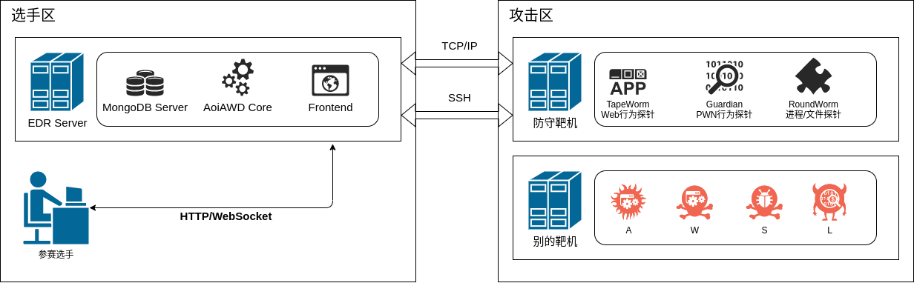
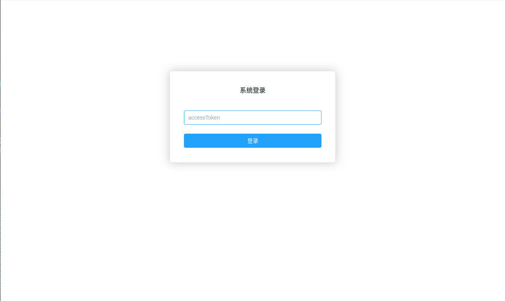
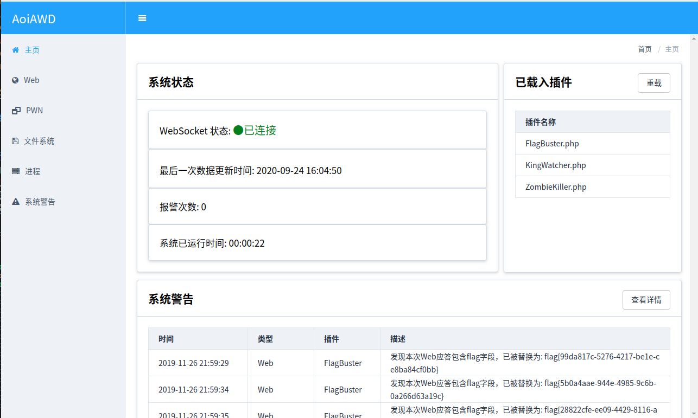
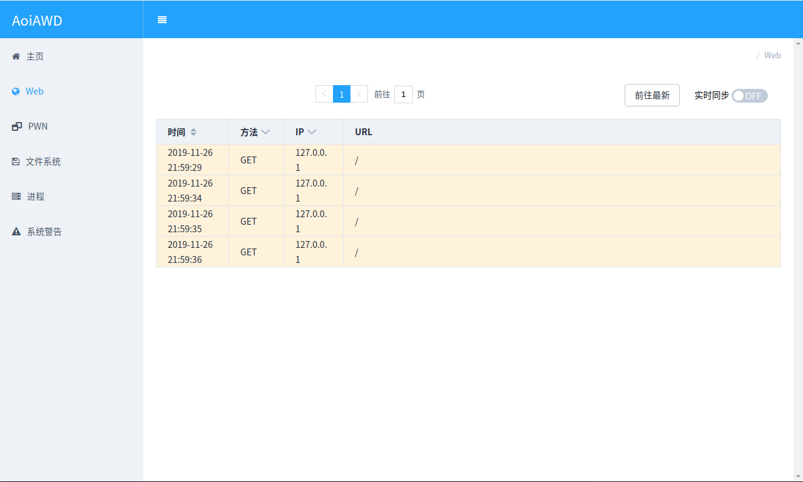
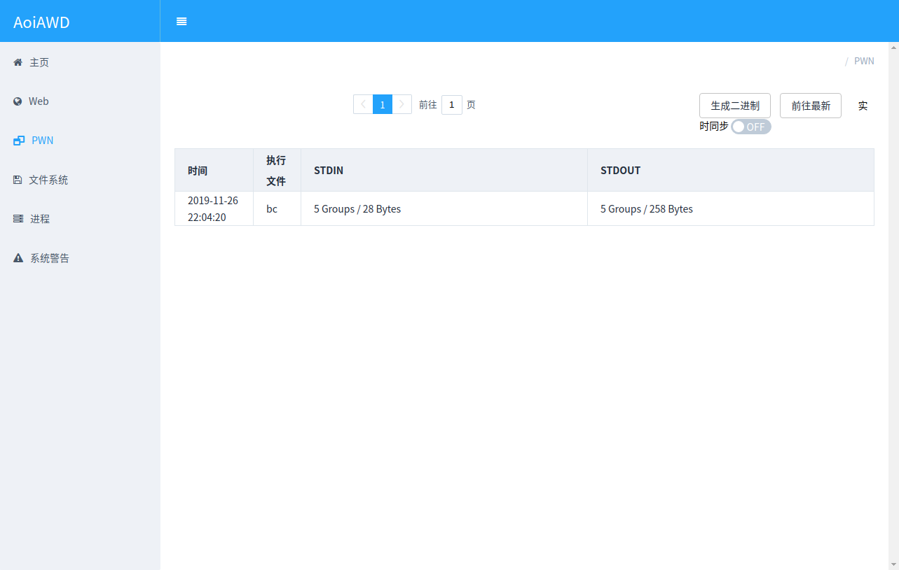
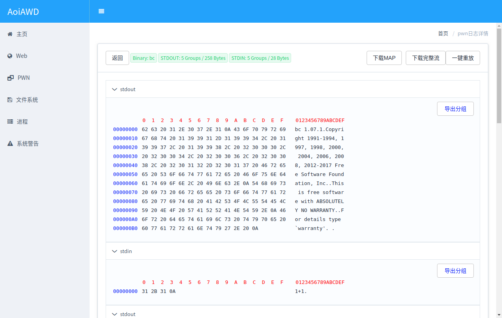
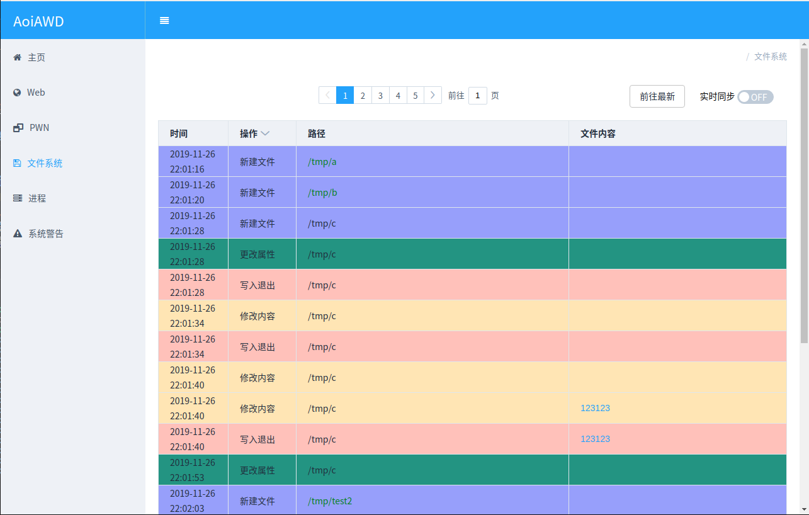
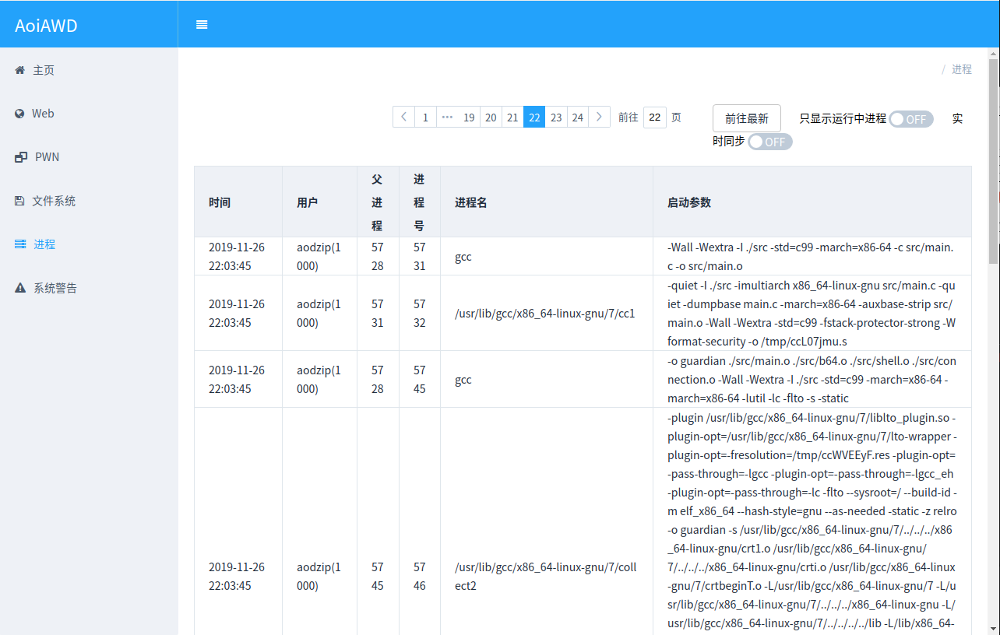
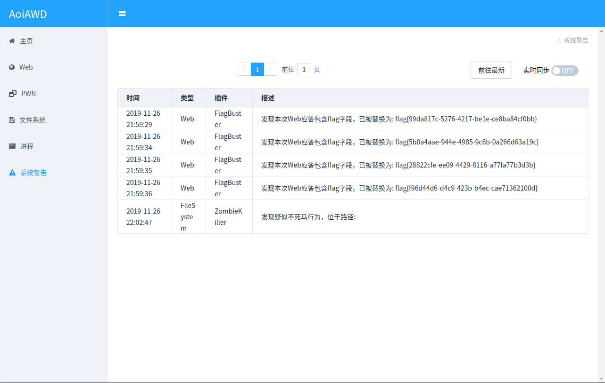
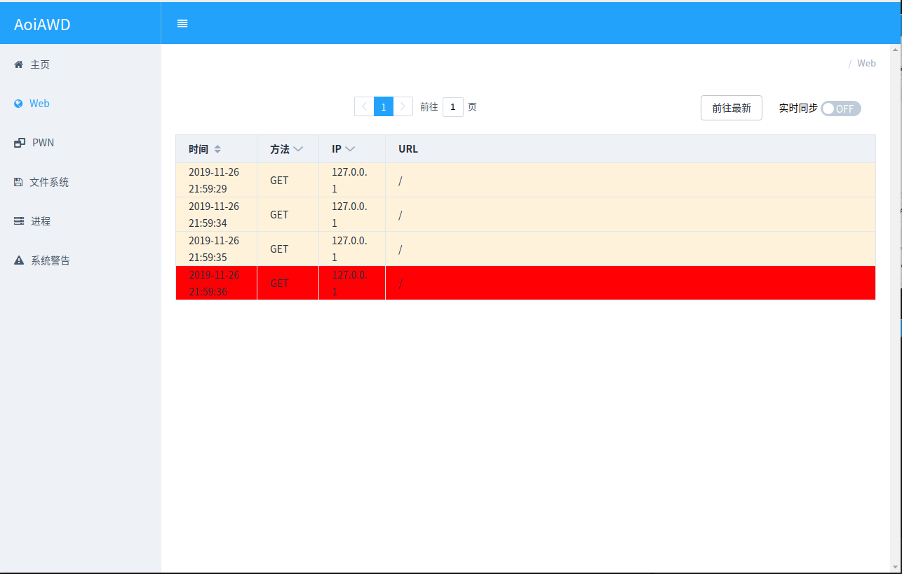

# AoiAWD-轻量级EDR系统
AoiAWD 是一个由Aodzip（安恒信息 海特实验室研究员、HAC战队成员）维护的一个针对于CTF AWD模式的开源项目。专为比赛设计，便携性好，低权限运行的EDR系统。任何人都可以在 GNU AGPL-3.0 许可下使用该项目和分享该项目的源码。

## 应用场景
在常见的AWD比赛中，选手往往拥有一台（或若干台）开放了SSH服务和题目服务的“靶机”作为自己防守的阵地。

在实际比赛中，主办方往往会限制选手的SSH权限到一般用户/仅可管理题目的权限。并且针对一些常见的通用防火墙脚本（通防脚本）进行轮询式check。

AoiAWD是针对以上场景的限制和痛点设计的，组件间基于socket通信以便灵活部署，具有图形可视化界面。所有行为探针均支持在最低系统权限下运行，且默认不会干扰题目业务逻辑的正常运行，可以绕过绝大部分check脚本的行为检查。支持如下维度的行为捕获能力：
- Web输入输出数据捕获、输出流量篡改（没错，你可以动态替换掉输出的flag为任意字符串）
- PWN类题目输入输出交互流量包捕获、当次运行时内存结构捕获、输出流量篡改
- 服务器进程UID、PID、父进程、启动参数、运行时间捕获
- 服务器文件系统新建、删除、修改、权限变化行为捕获。

本系统还内置了生命周期钩子，可以针对某一次行为的产生编写特定的插件去实现流量层面的临时热补丁、增加大屏告警、替换输出字符等操作。系统默认内置了如下插件可供参考：
- FlagBuster: 当检测到输出流量中包含了符合正则的flag字符串，产生大屏告警、标记触发规则的数据包、并将flag精准替换为看起来也像flag的随机数。
- KingWatcher: KoH类比赛中，当有其他队伍替换掉了赛点文件时，产生大屏告警。
- ZombieKiller: 当文件系统上出现了不死马行为，标记可疑文件并产生大屏告警。

## 系统简介
AoiAWD 分为六个组件，组件间互相配合实现系统的完整功能
- MongoDB Server: 日志数据存储数据库
- AoiAWD Core: 中心数据处理与插件后端服务器
- Frontend: 数据可视化平台前端
- Guardian: PWN行为探针
- TapeWorm: Web行为探针
- RoundWorm: 系统进程与文件系统行为探针



## 系统截图

### 登陆界面

### 仪表盘

### Web日志列表

### Web日志详情

### PWN日志列表

### PWN日志详情

### 文件系统日志列表

### 系统进程列表

### 告警日志列表

### 双击告警日志后高亮关联


## 编译、安装与使用方法
### 构建方法
参考构建流程简介进行操作: [BUILD.md](BUILD.md)

### MongoDB Server
用于记录庞大的流量文件的数据库，是整个系统的核心存储。
- 一般情况下建议和AoiAWD Core一起部署在选手自己可控的主机上。
- 无需额外的配置，Ubuntu环境下开箱即用，apt一下即可搞定。

### Frontend
Vue编写的Web前端，用来浏览日志，产生报警动画等可视化展示。
- 使用npm编译打包。
- 一般情况下编译后将与AoiAWD Core集成为一个可执行文件。
- 无需单独的运行启动。

### AoiAWD Core
是整个系统运行的核心，负责探针数据收集入库、插件生命周期管理、Web前端托管服务。
- 运行compile.php即可打包为一个单独的二进制文件，方便携带。
- 插件需要放到和aoiawd.phar同目录下的plugins文件夹，Web端有直接重载插件的按钮，可以实现热更新。
- 一般情况下可直接无参数运行，如果需要特别的配置，可以增加-h参数查看帮助信息。
```
AoiAWD: Data Visualization Tool & Main Server
Usage: ./aoiawd.phar [OPTIONS]
         -w [URI] HTTP server bind URI. Default: tcp://0.0.0.0:1337
         -l [URI] Log recoard server bind URI. Default: tcp://0.0.0.0:8023
         -m [URI] MongoDB server URI. Default: mongodb://127.0.0.1:27017
         -t [STRING] Access token. Default: [RANDOM]
         -h This help info
```
- 运行后会显示本次启动后的临时密钥，是访问Web前端的必要信息
```
[2020-09-24 15:21:21] MainServer.notice: AccessToken: 0de8d57b3e91dc66 [] [] #<-- Web访问密钥
...
[2020-09-24 15:21:21] Amp\Http\Server\Server.info: Listening on http://0.0.0.0:1337/ [] [] #<-- Web前端地址
[2020-09-24 15:21:21] aoicommon\socket\AsyncTCPServer.info: Listening on 0.0.0.0:8023 [] [] #<-- 探针上线地址
```
### Guardian
一个二进制PWN的影子外壳，其原理是包裹在PWN题目外侧，在每次被启动的时候透明记录STDIN与STDOUT的流量，并快照PWN程序的内存结构(/proc/????/mem)上传回AoiAWD Core。
- 在项目目录运行compile.php将会编译影子壳程序和捆绑程序: guardian.phar，一般是在选手电脑上进行捆绑后将生成文件上传到靶机。
- 直接运行捆绑程序会输出帮助文本，其中比较重要的一些参数是:
  - -i: 输入需要套壳的PWN题目程序路径
  - -s: 输入可以从靶机访问到探针上线地址的URL，比如说192.168.???.???:8023
```
Guardian: AoiAWD ELF PWNMonitor Tool
Usage: ./guardian.phar [PATH]
         -i [PATH] Original ELF.
         -o [PATH] Path of patched ELF. Default: {$OriginalELF}.guardianed
         -s [URI] Log recoard server URI. Default: 127.0.0.1:8023
         -h This help info
```
### TapeWorm
一个PHP Web的影子外壳，其原理是自动注入到**所有**PHP文件的头部，支持输入输出流量的抓取与上报，同时具有处理输出数据的能力，实现输出内容篡改。
- 程序内部的代码已经实现了单实例启动，即便是层层include了多次，也只会运行最先触发的影子外壳。所以不用担心复杂的题目影响性能。
- 自动注入程序会智能识别面向对象的文件(包含 namespace 关键字)，和直接面向过程的PHP文件，**一般**情况下不会造成语法错误。
- 自动注入程序会识别已经被注入的脚本并加以跳过，所以多次反复无脑对web根目录运行注入程序并不会造成什么太大的问题。
- 运行compile.php就可以生成自动注入程序，一般情况下可以上传到靶机上直接对web根目录进行注入，或者在选手电脑上注入好之后再上传到靶机上。
- **一时注入一时爽，忘记备份宕机慌**
- 直接运行注入程序会显示帮助文本，其中比较重要的一些参数是:
  - -d: 需要注入外壳的web根目录，会从此目录递归感染所有的PHP文件。
  - -s: 输入可以从靶机访问到探针上线地址的URL，比如说192.168.???.???:8023。
```
TapeWorm: AoiAWD PHP WebMonitor Tool
Usage: ./tapeworm.phar [PATH]
         -d [PATH] WebMonitor inject dir.
         -s [URI] Log recoard server URI. Default: 127.0.0.1:8023
         -f [PATH] Inject file path. Default: {$dir}
         -h This help info
```
### RoundWorm
一个监控文件系统和进程的系统行为监视器，其原理是扫描/proc文件夹获取当前正在运行的所有进程的信息，以及利用Linux系统的inotify功能对指定文件夹的敏感文件操作进行全面的记录。
- 直接运行make就可以编译生成
- 一般来讲该程序在靶机上运行，选手电脑上没必要执行这玩意。
- 添加-h参数即可看到帮助文档，其中比较重要的一些参数是:
  - -d: 后台运行，你当然不想关掉ssh的时候就把探针也给关了。
  - -s: 输入可以从靶机访问到探针上线地址的IP，比如说192.168.???.???。
  - -w: 需要监控文件变化的路径，如果有多个路径使用';'分割，比如: -w "/tmp;/var/www/html"
```
RoundWorm: AoiAWD Filesystem & Process Monitor Tool
Usage: ./roundworm [OPTIONS]
         -d Running in daemon mode.
         -s [HOST] AoiAWD Probe IP. Default: 127.0.0.1
         -p [PORT] AoiAWD Probe PORT. Default: 8023
         -w [PATH] Inotify watch dir, ';' as divider. Default: /tmp
         -i [MSECOND] Process watch interval. Default: 100
         -h This help info
```
